# Pokémon Explorer - Litsight Challenge

¡Bienvenido a Pokémon Explorer! Esta es una Pokédex interactiva desarrollada como desafío técnico para Litsight. Permite explorar los 151 Pokémon de la primera generación, ver sus detalles, filtrar por tipo y alternar entre vista de tabla y cuadrícula.

## 🚀 Demo

[Ver la app desplegada en GitHub Pages](https://ImCrisam.github.io/Next_PokeApi)


## 🧩 Características principales

- **Consumo de la PokéAPI**: Obtiene los 151 Pokémon y sus detalles desde [pokeapi.co](https://pokeapi.co/).
- **Vista en tabla**: Ordena, filtra y pagina usando Material UI DataGrid.
- **Vista en cuadrícula**: Tarjetas responsivas con imagen, nombre, número y tipos.
- **Modal de detalles**: Al hacer clic en cualquier Pokémon, muestra toda su información y estadísticas.
- **Filtrado por tipo**: Selector visual y multiselección de tipos.
- **Resaltado de estadísticas**: Las estadísticas más altas se resaltan en verde y las más bajas en rojo.
- **100% en el cliente**: Todo el procesamiento de datos, filtros y ordenamientos es local.
- **UI moderna**: Inspirada en la saga Pokémon, con fuentes y colores personalizados.

## 📦 Instalación y uso local

1. Clona el repositorio:
   ```sh
   git clone https://github.com/ImCrisam/Next_PokeApi.git
   cd Next_PokeApi
   ```
2. Instala las dependencias:
   ```sh
   npm install
   ```
3. Inicia el servidor de desarrollo:
   ```sh
   npm run dev
   ```
4. Abre [http://localhost:3000](http://localhost:3000) en tu navegador.

> 

## 🛠️ Tecnologías usadas
- [React](https://react.dev/)
- [Next.js](https://nextjs.org/)
- [Material UI](https://mui.com/)
- [TypeScript](https://www.typescriptlang.org/)
- [PokéAPI](https://pokeapi.co/)

---

## 📚 Documentación técnica detallada

Para una explicación técnica y arquitectura del proyecto, consulta el archivo [DOCUMENTACION_DETALLADA.md](./DOCUMENTACION_DETALLADA.md).


## ✨ Autor
- [ImCrisam](https://github.com/ImCrisam)

---
## 📸 Capturas de pantalla

### 🌓 Vista Grid (Modo oscuro)
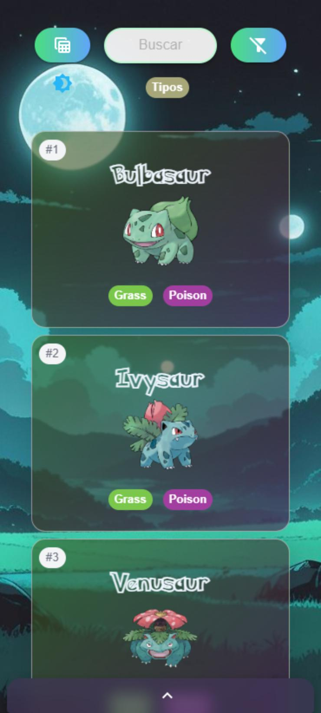

### 🧱 Vista Grid (Layout general)
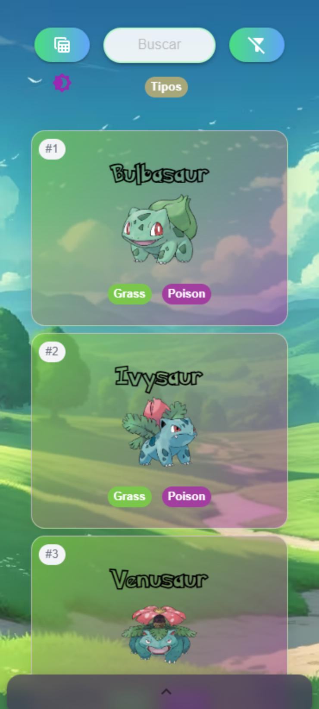

### 🔍 Vista Grid + Filtro por tipo
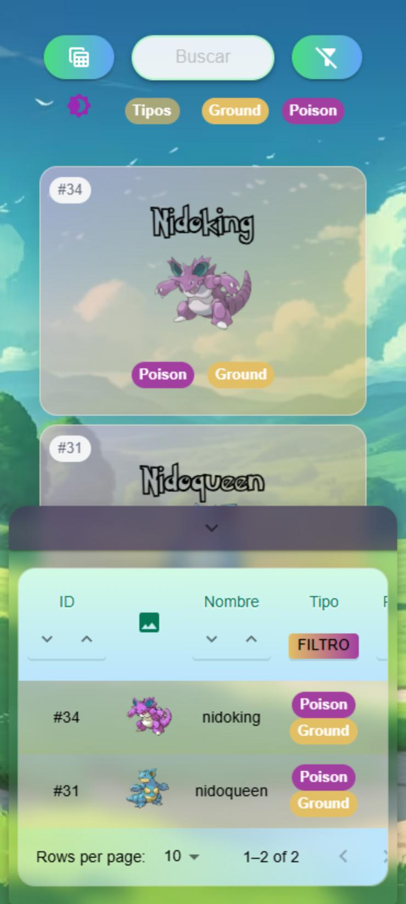
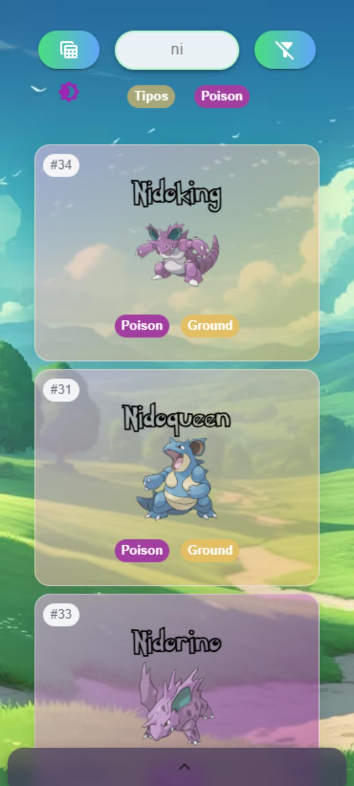

### 📋 Vista Grid + Modal de detalles
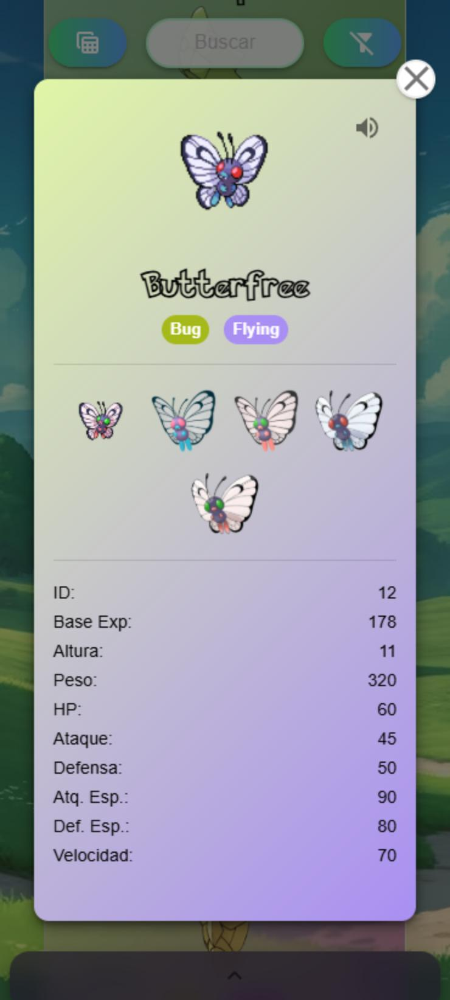

---

### 🌓 Vista Tabla (Modo oscuro)
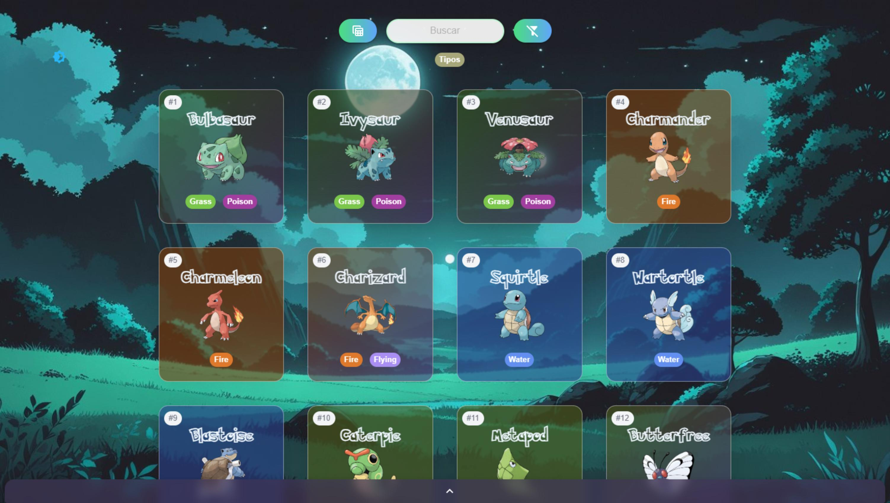

### 📋 Vista Tabla (Layout general)
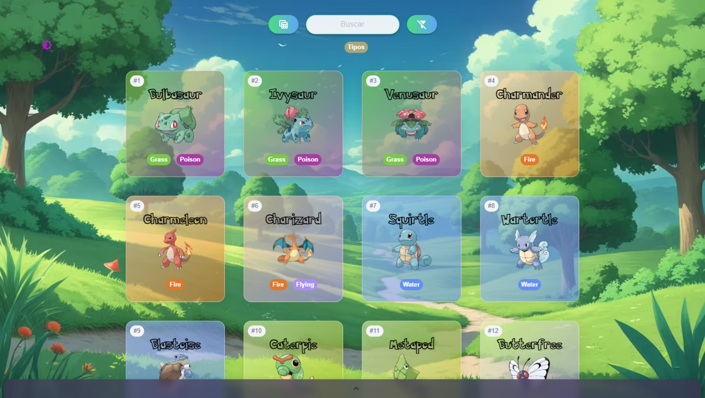

### 🔍 Vista Tabla + Filtro por tipo
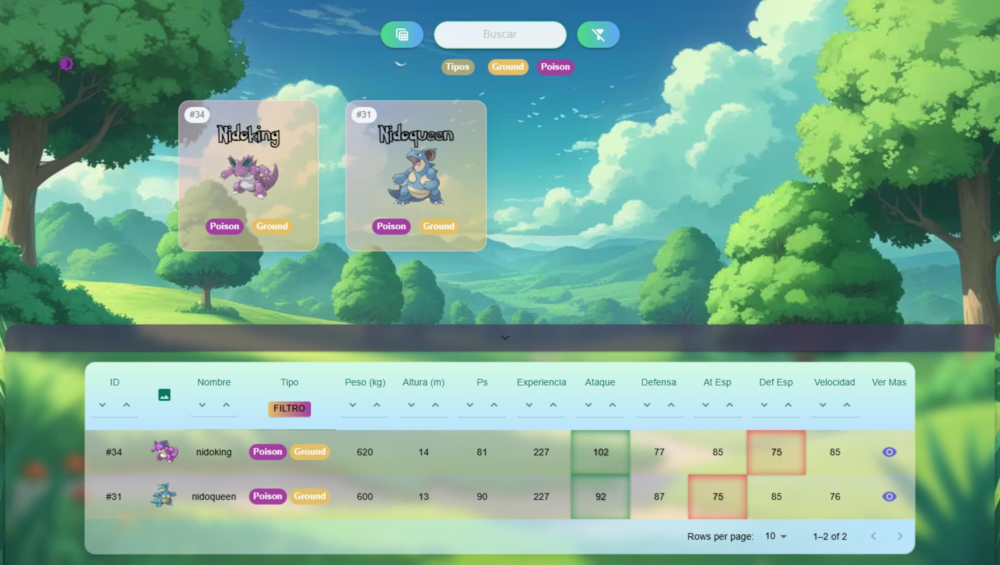
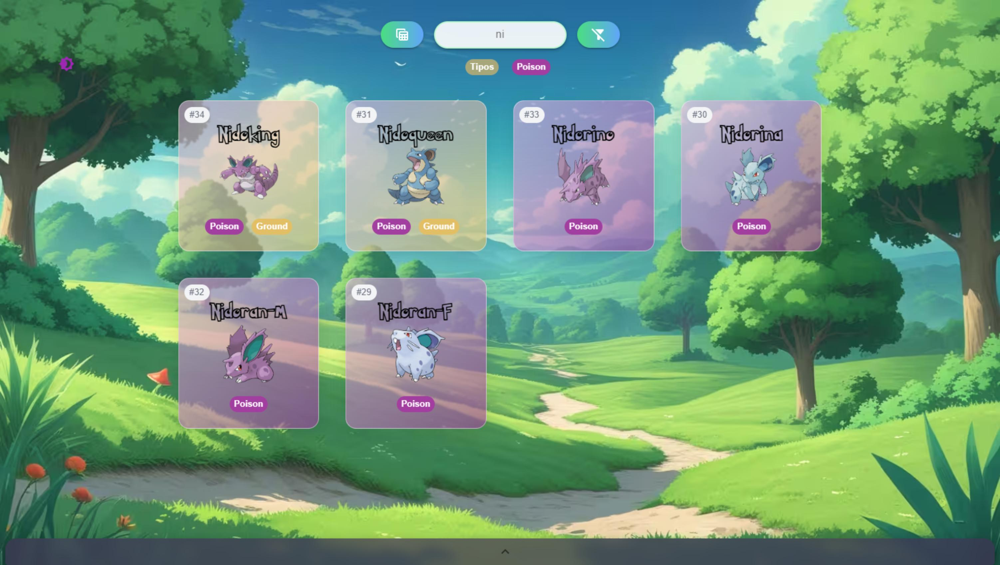

### 📋 Vista Tabla + Modal de detalles
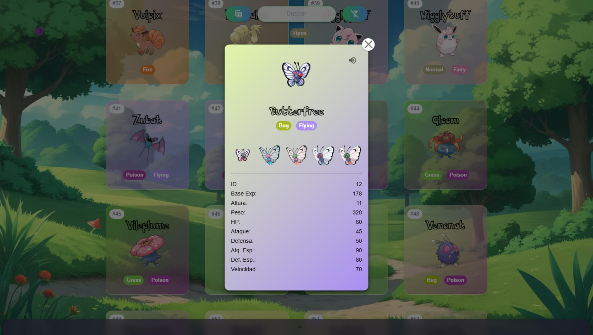

### 📑 Vista Tabla - Paginación y ordenamiento
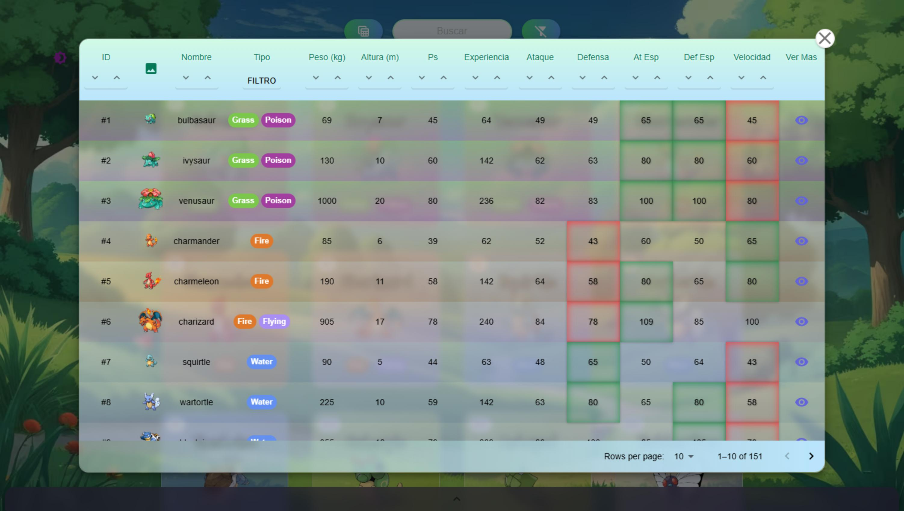


¡Gracias por revisar este proyecto! Si tienes feedback o sugerencias, no dudes en abrir un issue o un pull request.

